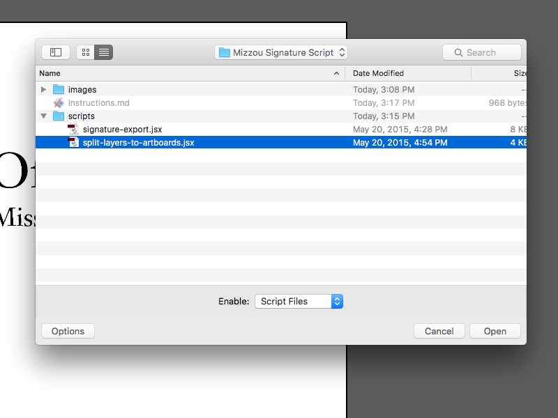

# Mizzou Unit Signature Export Script

With these scripts, we want to end up with an Illustrator file (.ai) that can be used as a source file, and an export folder with all the variations of that file for distribution and production.

Tested on Adobe Illustrator CC 2014 and 2015 on the Mac.

## Artboard Split

The goal of the artboard split script is to convert an existing signature art file that is 2-up into a 2 artboard set up. The resulting file will become the unit signature's *source file.* 

**Note:** This is a 1 time use. Once all existing signatures have been converted, this script will no longer be needed.

1. Open an existing unit signature eps file in Adobe Illustrator.
2. Check the document set up
	* In CMYK colorspace
	* Gold is the CMYK build as a swatch named "C=0 M=25 Y=90 K=5" 
	* Black is a grey color swatch set to 100%
	* Has artboards for horizontal and vertical versions of signatures
3. Select the horizontal signature
4. Cut (cmd+x) the signature
5. Make a new layer. Name it "horizontal" in all lowercase. 
6. Paste in Place (shift+cmd+v) onto "horizontal" layer.
7. Rename the original layer to "vertical" in all lowercase.
8. You should end up with 2 layers named "horizontal" and "vertical" with the corresponding art on each one.
	
9. Select File > Scripts > Other Script...
	
10. Open the "split-layers-to-artboards.jsx" file in the scripts folder.
	
11. The two layers will become 2 artboards with proper clear space around the signature.
	
12. Select File > Save As... 
	
13. Save as a new Adobe Illustrator file (.ai)
	

You now have a source file to use with the export script.

## Export 

The goal of the export script is to take the unit signature's *source file* and export all the file formats and color setups needed into an "export" folder.

1. Open the AI source version of the signature.
2. Check the document set up (The script requires we start with this set up.)
	* In CMYK colorspace
	* Gold is the CMYK build as a swatch named "C=0 M=25 Y=90 K=5" 
	* Black is a grey color swatch set to 100%
	* Has artboards for horizontal and vertical versions of signatures
3. Save your changes if needed.
4. Select File > Scripts > Other Script... 
	
5. Open the "signature-export.jsx" file in the scripts folder.
	
6. Choose the destination folder "export". If it doesn't exist, create one.
 	
7. The script will run. This may take a minute. Illustrator must stay in focus while the script is running. You cannot work in another app until the script is done.
8. You will get a "Done!" dialog box and the document will close without saving.
 	
9. The export folder will have 2 folders inside: "print" and "screen". These will contain their corresponding variations of signature files. 
	

The export folder files are to be distributed. The source Illustrator file is for internal use only to create the exported files.

## Exported Files 

All have black text and white text versions.

### Print 

* 1C - EPS
* 2C Coated - EPS
* 2C Uncoated - EPS
* 4C - EPS

### Web

* RGB - EPS
* RGB - PNG

All versions have transparent backgrounds. 

It isn't possible to export CMYK JPG files. I would not make them. 

* Printers will not use them. 
* They show up on the Web.
* No white text option.

If people ask for them, we can direct them to something that works better and educate a little.

